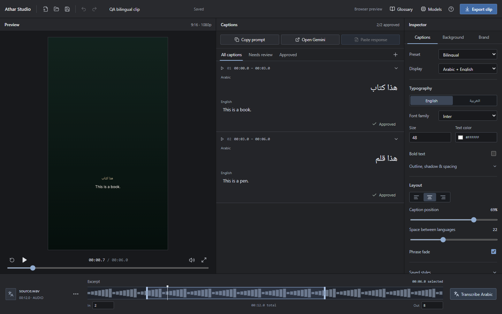

# Athar Studio

A Windows desktop editor for translated Arabic lecture clips. The workflow is import → select one excerpt → transcribe Arabic locally → manually translate with Gemini → review → style → export.

This is a working **0.1.1 Windows pilot**, with real native transcription and rendering. It does not automatically upload audio, call a paid translation API, or publish content.



[Development and contributions](CONTRIBUTING.md) · [Changelog](CHANGELOG.md) · [GitHub handoff](docs/GITHUB.md) · [Validation](docs/VALIDATION.md)

## Use the desktop app

The Windows installer is produced in `src-tauri/target/release/bundle/nsis/`.

1. Install and open **Athar Studio**.
2. Import an MP3, WAV, M4A, MP4, MOV, or MKV. Playback preparation and waveform generation run in the background.
3. Drag the excerpt handles, or enter start/end times. One project contains one continuous passage.
4. Open **Models**, download a model, and choose **Auto** or **CPU only**. Balanced is the default; changing device never changes model.
5. Choose **Transcribe Arabic**. Listen through the result and correct the Arabic where necessary.
6. Optionally enter your terminology preferences in **Glossary**. Choose **Copy prompt**, paste it into Gemini, then bring the complete JSON reply into **Paste response**.
7. Resolve Arabic corrections and uncertainty flags against the audio. Edit the translation and approve every caption.
8. Customize the look, background, source labels, and channel logo. Save a personal preset if desired.
9. Export MP4 with burned-in captions, or separate Arabic/English SRT files.

The app downloads its speech model on demand, outside the installer. After installation and model download, editing, transcription, and rendering work offline. The manual Gemini step needs internet access.

**AI review limits:** Gemini receives text, not audio. Its Arabic corrections are proposals until the creator checks them. The app never labels machine output as scholarly verification.

## What is implemented

- Tauri 2 / React / TypeScript / Rust desktop workspace.
- Local media probing, playback proxies, waveform, excerpt handles, and original audio preservation.
- whisper.cpp Arabic transcription; bundled CPU and Vulkan executables; automatic CPU fallback; visible device result.
- Three downloadable multilingual models with SHA-256 verification, cancellable jobs, progress, and retry.
- Versioned Gemini JSON handoff, exact request snapshots, stable segment IDs, atomic import, and repair prompts.
- Original transcript preservation, independently detected Arabic changes, correction decisions, uncertainty resolution, and exact text/timing approvals.
- Phrase timing, independent Arabic/English split positions, merge, word/phrase emphasis, manual line breaks, and readability suggestions.
- English and bilingual modes; four presets; font size, weight, colors, outline, shadow, spacing, alignment, positioning, and fades.
- Source footage, solid/gradient/image/video backgrounds, crop/fit, dim, blur, source labels, and logos. Background video audio is never mixed in.
- Vertical, square, and landscape 1080p H.264/AAC exports at 30 fps; Arabic and English SRT.
- Shared ASS subtitle generation and matching TrueType font files for browser preview and FFmpeg/libass export.
- Local project files with associated visual assets, autosave/recovery, backup copies, undo/redo, and source relinking.
- Native export validation, one-heavy-job enforcement, cancellation, and completed-file publication.

## Development

Prerequisites for native development: Windows x64, Node 22 (20.19+ also supported), Rust 1.88+, Visual Studio C++ build tools with the **Desktop development with C++** workload, WebView2, FFmpeg with libass/libx264 and ffprobe, and 7-Zip for portable Vulkan SDK extraction. The Windows pilot was built using Visual Studio 2026. Tools are not required on a creator's machine when using the installer. See the [Tauri Windows prerequisites](https://v2.tauri.app/start/prerequisites/) for build-tool installation.

```powershell
npm ci
npm run prepare:runtime
npm run desktop
```

`prepare:runtime` downloads the pinned upstream whisper.cpp CPU release, copies an installed FFmpeg build, builds the Vulkan executable, and includes the local Microsoft C++ runtime files. When `VULKAN_SDK` is absent, it downloads and verifies a portable SDK inside `.runtime-cache`; it does not install the SDK system-wide. The SDK, models, build outputs, and large binaries are excluded from source control.

For an explicitly CPU-only developer build:

```powershell
powershell -NoProfile -File scripts/prepare-runtime.ps1 -SkipGpu
```

For a browser workspace preview, only Node and npm are required:

```powershell
npm ci
npm run dev
```

Open `http://127.0.0.1:1420`. The browser can open/edit `.athar` projects and export SRT; native media processing is intentionally available only in the Windows app.

`npm run dev` and `npm run build` prepare the local fonts and subtitle renderer automatically. Generated assets and downloaded runtimes are rebuilt locally and are not checked into Git.

Build an installer:

```powershell
npm run desktop:build
```

## Project and review data

Saved projects use `.athar` JSON with `schemaVersion: 1`. Visual assets are copied to a neighboring `.assets` folder. Original source media is referenced rather than duplicated. A previous saved version is retained as `.athar.bak`. Application recovery and models live under the app's Windows data directory; playback proxies live under its cache directory.

Each Gemini request records a snapshot of the media, excerpt, glossary, and caption IDs/text/timings. A reply from an older snapshot is rejected. Returned IDs may be reordered, but missing, duplicate, unknown IDs and additional timing fields are rejected. Imported responses are archived in the project.

Every approval records the exact Arabic, English, start, and end values. Editing text or timing clears approval; styling leaves it intact. Correction and uncertainty flags must each be resolved. Relinking a source clears approvals because matching duration alone cannot establish that the speech is identical.

Transcription runs only on the chosen excerpt. Background rendering always maps the original lecture's audio track. Export paths cannot overwrite source assets. All external processes receive argument arrays, not interpolated shell commands.

## Verification

```powershell
npm run check
npm run test:native
```

Browser and native integration procedures, evidence, and the remaining human pilot requirements are documented in [docs/VALIDATION.md](docs/VALIDATION.md). Architecture and runtime sources are in [docs/ARCHITECTURE.md](docs/ARCHITECTURE.md) and [THIRD_PARTY_NOTICES.md](THIRD_PARTY_NOTICES.md).

The first release focuses on short excerpts. Full lectures, multiple excerpts, cloud accounts, automatic translation APIs, team approval, custom keyframes, extra language pairs, and automatic publishing are outside this pilot.

## License

Athar Studio's original source is available under the [MIT license](LICENSE). Dependencies and bundled runtimes retain their own licenses; see [THIRD_PARTY_NOTICES.md](THIRD_PARTY_NOTICES.md). Windows installers belong in GitHub Releases, not in the Git history.
